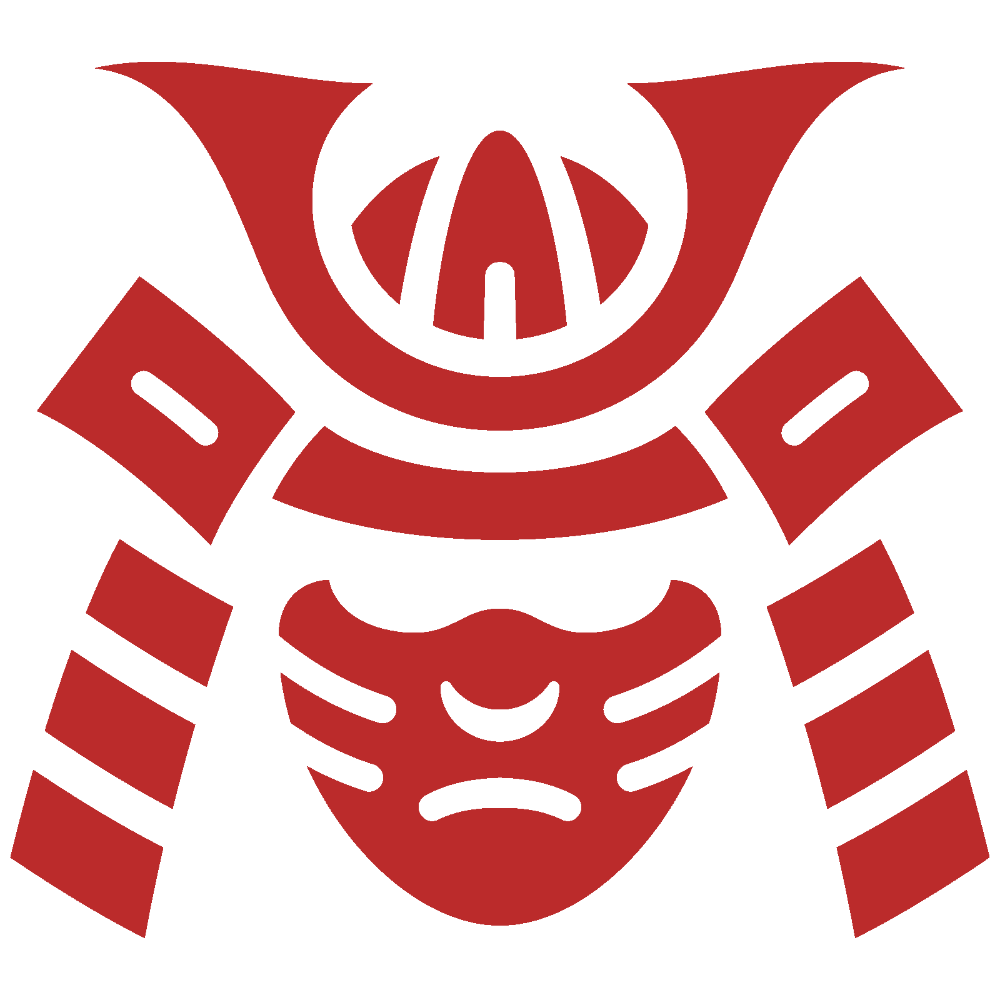

# Spamurai - AI-Powered Email Protection

{: width="150px" height="auto" }

Spamurai is a powerful Chrome extension that provides AI-powered protection against email threats, spam, and phishing attempts. The extension leverages custom AI models to analyze email patterns and identify potential threats in real-time.

Visit us at [spamurai.online](https://spamurai.online)

## 🚀 Features

- **AI-Powered Analysis**: Custom-built AI model for real-time threat detection
- **Security Verification**: Automatic SPF and DKIM checks for email authenticity
- **Spam Analytics**: Detailed tracking and visualization of spam reduction
- **Link Scanner**: Deep scanning of embedded links and attachments

## 🛠️ Tech Stack

- **Frontend Framework**: React with TypeScript
- **Styling**: Tailwind CSS
- **Build Tool**: Vite
- **Routing**: React Router v6
- **Icons**: Font Awesome
- **Deployment**: AWS
- **Domain**: spamurai.online

## Project Structure

```
spamurai/
├── src/
│   ├── pages/
│   │   ├── Home.tsx
│   │   ├── PrivacyPolicy.tsx
│   │   └── TermsOfService.tsx
│   ├── components/
│   │   └── WaveBackground.tsx
│   ├── ScrollToTop.tsx
│   └── App.tsx
├── public/
│   └── logo_red.png
└── index.html
```

## Getting Started

1. Clone the repository:
```bash
git clone https://github.com/yourusername/spamurai.git
```

2. Install dependencies:
```bash
cd spamurai
npm install
```

3. Start the development server:
```bash
npm run dev
```

4. Build for production:
```bash
npm run build
```

## Chrome Extension

The Chrome extension will be available on the Chrome Web Store soon. The website's "Get Started", "Install Now", and "Add to Chrome" buttons will be updated with the Chrome Web Store link once published.

## Development

This project uses:
- TypeScript for type safety
- Tailwind CSS for styling
- React Router for navigation
- Vite for fast development and optimized builds

## Deployment

The website is deployed on AWS and accessible at spamurai.online. The deployment process includes:
1. Building the production bundle
2. AWS deployment
3. Domain configuration

## 📄 License

This project is licensed under the MIT License - see [LICENSE](LICENSE) for more details.
